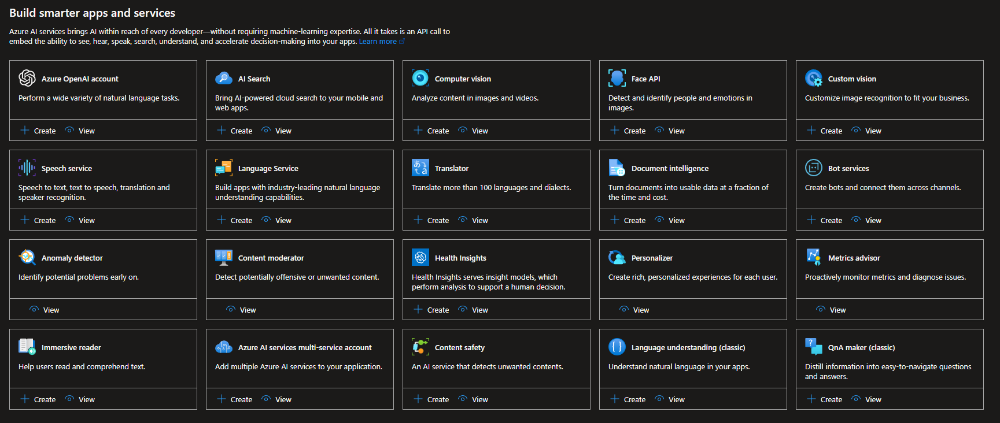

# ⚠️ Exam Update - April 30, 2025 <!-- markmap: fold -->

* **Major exam update** effective April 30, 2025
* **Key changes**:
  * New focus on **Azure AI Foundry** platform and services
  * New section: **Agentic Solutions** (5-10%)
  * Expanded **Generative AI** content (15-20%)
  * New **Responsible AI** requirements
  * Terminology update: "Azure AI Services" → "Azure AI Foundry Services"
* **Passing score**: 700 or greater
* **Exam languages**: English (other languages updated ~8 weeks later)

# AI-102 - Resources <!-- markmap: fold -->

* [AI-102: Azure AI Engineer Associate](https://learn.microsoft.com/en-us/certifications/exams/ai-102)
* Course: [Designing and Implementing a Microsoft Azure AI Solution](https://learn.microsoft.com/en-us/training/courses/ai-102t00/)
* [Study Guide (Updated April 30, 2025)](https://learn.microsoft.com/en-us/credentials/certifications/resources/study-guides/ai-102)
* [Practice Assessment](https://learn.microsoft.com/en-us/credentials/certifications/azure-ai-engineer/practice/assessment?assessment-type=practice&assessmentId=61&practice-assessment-type=certification)
* [Exam Prep Videos](https://learn.microsoft.com/en-us/shows/exam-readiness-zone/preparing-for-ai-102-plan-and-manage-an-azure-ai-solution)
* [Exam Sandbox](https://aka.ms/examdemo): Experience the look and feel of the exam interface before taking it.

## Azure AI Foundry Platform

* [Azure AI Foundry Portal](https://ai.azure.com/)
* [Azure AI Foundry Documentation](https://learn.microsoft.com/en-us/azure/ai-foundry/)
* [Azure AI Foundry API Reference](https://learn.microsoft.com/en-us/rest/api/aifoundry/)
* **Unified platform** for building AI solutions
* **Projects**: Organize agents, evaluations, and files
* **SDKs**: Python, C#, JavaScript/TypeScript (preview), Java (preview)
* **VS Code Extension**: Direct development environment integration

## Additional Resources

* Azure [AI Hub](https://azure.github.io/aihub)
* [Microsoft Q&A](https://learn.microsoft.com/en-us/answers/products/)
* [AI - Machine Learning Community](https://techcommunity.microsoft.com/t5/ai-machine-learning/bd-p/MachineLearning)

# Skills at a glance

## Plan and manage an Azure AI solution (20–25%)

### Select the appropriate Azure AI Foundry services

#### List of Azure AI Foundry Services

* 

#### Select the appropriate service for a computer vision solution

##### Azure AI Vision

* Processes images and videos to understand their content

##### Face API

* Detects and recognizes human faces

##### Azure AI Custom Vision Service

* Builds and deploys custom image classification models

##### Document Intelligence

* Extracts text, key-value pairs, and tables from documents

##### Azure AI Video Indexer

* Extracts insights from videos and live streams

#### Select the appropriate service for a natural language processing solution

* Custom text classification
* Custom named entity recognition
* Conversational Language Understanding
* Entity Linking
* Key Phrase Extraction
* Language Detection
* Named Entity Recognition (NER)
* Orchestration workflow
* Personally identifiable information (PII) detection
* Question Answering
* Sentiment Analysis
* Summarization
* Text Analytics for Health

#### Select the appropriate service for a speech solution

##### Speech to Text

* Supports intermediate results, end-of-speech detection, automatic text formatting, profanity
  masking, and includes real-time speech-to-text and batch transcription

##### Language identification

* Identifies the spoken language in a given audio stream

##### Text-to-Speech

* Converts text to natural-sounding speech

##### Speech Recognition

* Identifies and verifies the people speaking based on audio

##### Pronunciation Assessment

* Evaluates the pronunciation and provides feedback on the accuracy and fluency of the
  speech

##### Speech translation

* Translates streaming audio in real-time and provides result as text/synthesized speech

##### Intent recognition

* Derives user intents from transcribed speech and act on voice commands

#### Select the appropriate service for a generative AI solution

* Build your own copilot and generative AI applications with:
  * Azure OpenAI Service
  * Azure AI Foundry
    * Unified platform for building AI solutions
    * Access to Azure OpenAI, DeepSeek, xAI, Mistral AI
    * Partner & Community Models: Cohere, Meta (Llama), Stability, etc.
    * Provides low-code/no-code environment in Azure AI Foundry portal
    * SDKs for Python, C#, JavaScript/TypeScript, Java

#### Select the appropriate service for an information extraction solution

* Azure AI Document Intelligence:
  * Document analysis model
  * Prebuilt model
  * Custom model
* Azure AI Content Understanding:
  * OCR pipeline for text extraction
  * Document summarization and classification
  * Entity, table, and image extraction

#### Select the appropriate service for a knowledge mining solution

* Azure AI Search

### Plan, create and deploy an Azure AI Foundry service

#### Plan for a solution that meets Responsible AI principles

1. **Fairness**: AI systems should treat all people fairly.
   - **Fairlearn**: An Open-source toolkit for assessing and improving the
     fairness of machine learning models.
2. **Reliability and safety**: AI systems should perform reliably and safely.
   - Test the model
   - Risks and harm related information should be accessible from the model users
3. **Privacy and security**: AI systems should respect privacy and maintain security.
   - Personally identifiable information (PII) should be protected
4. **Inclusiveness**: AI systems should empower everyone and engage people.
5. **Transparency**: AI systems should be transparent and understandable.
   - *Interpretability/Intellegibility*: The ability to explain the results of a model
     in a way that is understandable to humans.
6. **Accountability**: AI systems should be accountable to people.
   - **Model governance**: The process of managing the entire lifecycle of a model,
     including model creation, deployment, and monitoring.
   - **Organizational principles**: Define the roles and responsibilities of the
     people involved in the model lifecycle.

#### Create an Azure AI resource

* From the Azure portal
* Using Azure CLI
* Using client library
* Using ARM templates, Bicep, or Terraform

#### Choose the appropriate AI models for your solution

* Consider model capabilities and requirements
* Evaluate model performance and cost
* Select deployment options based on use case

#### Deploy AI models using the appropriate deployment options

* Azure AI Foundry projects
* Hub-based projects (legacy)
* Managed compute deployments
* Container deployments

#### Install and utilize the appropriate SDKs and APIs

* Azure AI Foundry SDK: Python, C#, JavaScript/TypeScript, Java
* Azure OpenAI SDK
* REST APIs for Azure AI Foundry services

#### Determine a default endpoint for a service

* Multi-service resource
  * Multiple Azure AI resources with a single key and endpoint
  * Consolidate billing from the the services you use
* Single-service resource
  * Single Azure AI resource with a single key and endpoint
  * Use free tier for testing and development: only supported in single-service resources
* Endpoint URI is one of the three primary parameters for Azure AI
* 2 (access) keys are provided for each Azure AI resource by default
  * Protect the keys by using Azure Key Vault
* Authenticate with:
  * Single or multi-service key
  * Token (REST API)
  * Entra ID identity

#### Integrate Azure AI services into a continuous integration and continuous delivery (CI/CD) pipeline

#### Plan and implement a container deployment

* ==Azure Container Instances== (ACI): on demand standalones containers with minimal setup in
  serverless environment.
* ==Azure Kubernetes Service== (AKS): Managed Kubernetes service for deploying, managing, and
  scaling containerized applications using Kubernetes.

### Manage, monitor, and secure an Azure AI Foundry Service

#### Configure diagnostic logging

* Enable diagnostic logging for an Azure AI resource:
  * ==Log Analytics Workspace== to analyze logs and metrics (Azure Monitor)
  * ==Event Hub== for streaming logs to other services
  * ==Storage Account== for archiving logs with less expensive storage

#### Monitor an Azure AI resource

* *Metrics*: capture regular data points about the behavior of the resource in time-series database
* *Alerts*: notify you when a metric breaches a threshold
* *Diagnostics settings*: configure the resource to send logs and metrics to a destination
* *Activity logs*: records operations made on the resource

#### Manage costs for Azure AI services

* [Azure Pricing Calculator](https://azure.microsoft.com/en-us/pricing/calculator/)
  * Estimate the cost of Azure services
* [Azure Cost Management and Billing](https://docs.microsoft.com/en-us/azure/cost-management-billing/costs/quick-acm-cost-analysis?tabs=cost-analysis)
  * Monitor and analyze costs
  * Create budgets and alerts
  * Optimize costs
  * Billing administrative tasks

#### Manage and protect account keys

Users with `Cognitive Services Contributor` RBAC role can View/Copy/Regenerate keys under
  "Keys and Endpoint".

#### Protect account keys by using Azure Key Vault

* You can use Azure Key Vault to securely develop Azure AI services applications.
* Key Vault enables you to store your authentication credentials in the cloud, and reduces the
  chances that secrets may be accidentally leaked, because you won't store security information
  in your application.
  1. Navigate to your Azure resource in the Azure portal
  2. From the collapsible menu on the left, select `Keys` and `Endpoint`
  3. In Azure Key Vault, select `Objects` > `Secrets`
  4. Select `Generate/Import`
  5. Enter a *name* for the secret and the *value* you want to store

#### Manage authentication for an Azure AI Service resource

* Each request to an Azure AI service must include an authentication header.
  * Authenticate with a single-service or multi-service resource key
  * Authenticate with a token
  * Authenticate with Microsoft Entra ID
    * This scenario provides Azure RBAC integration with Azure AI services.

#### Manage private communications

* To secure your Azure AI services resource, you should first configure a rule to deny access to
  traffic from all networks, including internet traffic, by default. Then, configure rules that
  grant access to traffic from specific virtual networks.
  1. Go to the **Azure AI services** resource you want to secure
  2. Select **Networking**
  3. To deny access by default, under **Firewalls** and **virtual networks**,
    select **Selected Networks and Private Endpoints**.

* To grant access to a virtual network with an existing network rule:
  1. Go to the **Azure AI services** resource you want to secure.
  2. Select **Networking**
  3. Under **Allow access from**, select **Add existing virtual network**.
  4. Select the Virtual networks and Subnets options, and then select **Enable**.
    * > If a service endpoint for Azure AI services wasn't previously configured for the selected virtual network and subnets, you can configure it as part of this operation.
  5. Select **Save** to apply your changes.

### Implement AI solutions responsibly

#### Implement content moderation solutions

* Detect and filter harmful or inappropriate content
* Use Azure AI Content Safety for text and image moderation
* Configure severity thresholds and harm categories

#### Configure responsible AI insights, including content safety

* Monitor and analyze content safety metrics
* Review flagged content and model responses
* Implement feedback loops for continuous improvement

#### Implement responsible AI, including content filters and blocklists

* **Content filters**: Configure filters for hate speech, violence, sexual content, self-harm
* **Blocklists**: Create custom lists of prohibited terms or patterns
* Apply filters at deployment level for consistent protection

#### Prevent harmful behavior, including prompt shields and harm detection

* **Prompt shields**: Protect against prompt injection attacks
* **Harm detection**: Identify potential harmful outputs in real-time
* **Jailbreak detection**: Prevent attempts to bypass safety measures

#### Design a responsible AI governance framework

* Define roles and responsibilities for AI development
* Establish review and approval processes
* Implement monitoring and auditing mechanisms
* Create incident response procedures
* Document AI system limitations and risks

## Implement generative AI solutions (15–20%)

### Build generative AI solutions with Azure AI Foundry

#### Plan and prepare for a generative AI solution

* Define use cases and requirements
* Select appropriate models and services
* Design system architecture
* Plan for responsible AI implementation

#### Deploy a hub, project, and necessary resources with Azure AI Foundry

* **Azure AI Foundry project**: Container for organizing work
  * Manage agents, evaluations, and files
  * Project-level isolation of data and outputs
* **Azure AI Foundry resource**: Parent resource for management
  * Unified RBAC, networking, and policies
  * Cost analysis and monitoring

#### Deploy the appropriate generative AI model for your use case

* Azure OpenAI models: GPT-4, GPT-3.5, DALL-E
* Partner models: Mistral, Cohere, Meta Llama
* Community models via Marketplace
* Consider model capabilities, cost, and performance

#### Implement a prompt flow solution

* Design conversation flows
* Define prompts and prompt templates
* Implement branching logic
* Test and iterate on flows

#### Implement a RAG pattern by grounding a model in your data

* **Retrieval Augmented Generation (RAG)**:
  * Connect model to your data sources
  * Use Azure AI Search for indexing
  * Configure retrieval parameters
  * Ground responses in retrieved documents

#### Evaluate models and flows

* Test model responses for accuracy
* Measure performance metrics
* Compare different models and configurations
* Use evaluation datasets

#### Integrate your project into an application with Azure AI Foundry SDK

* Use SDKs: Python, C#, JavaScript/TypeScript, Java
* Implement authentication and authorization
* Handle API responses and errors
* Manage conversation state

#### Utilize prompt templates in your generative AI solution

* Create reusable prompt templates
* Define variables and placeholders
* Implement prompt versioning
* Test template variations

### Use Azure OpenAI in Foundry Models to generate content

#### Provision an Azure OpenAI in Foundry Models resource

* Create Azure OpenAI resource within Azure AI Foundry
* Configure network security
* Set up authentication and access controls

#### Select and deploy an Azure OpenAI model

* Available models:
  * GPT-4: Advanced natural language and code generation
  * GPT-3.5: Natural language and code generation
  * DALL-E: Image generation from text descriptions
  * Embeddings: Similarity search and semantic understanding

#### Submit prompts to generate code and natural language responses

* Design effective prompts for different tasks:
  * Classifying content
  * Generating new content
  * Transformation and translation
  * Summarization
  * Question answering
  * Code generation

#### Use the DALL-E model to generate images

* Generate images from textual descriptions
* Specify style and content characteristics
* Control image size and quality
* Implement image generation in applications

#### Integrate Azure OpenAI into your own application

* Use REST APIs or SDKs
* Implement authentication with API keys or Entra ID
* Handle rate limiting and throttling
* Manage response streaming

#### Use large multimodal models in Azure OpenAI

* Process both text and images as input
* Analyze images with natural language queries
* Generate descriptions and insights from visual content

#### Implement an Azure OpenAI Assistant

* Create assistant with specific instructions
* Define assistant capabilities and tools
* Manage conversation threads
* Implement assistant in applications

### Optimize and operationalize a generative AI solution

#### Configure parameters to control generative behavior

* **Temperature**: Controls randomness (0.0 to 2.0)
  * Lower: More focused and deterministic
  * Higher: More creative and diverse
* **Max tokens**: Limit response length
* **Top P**: Alternative to temperature for randomness control
* **Frequency penalty**: Reduce repetition
* **Presence penalty**: Encourage topic diversity
* **Stop sequences**: Define where model should stop

#### Configure model monitoring and diagnostic settings, including performance and resource consumption

* Enable diagnostic logging
* Monitor API usage and costs
* Track response times and latency
* Analyze error rates and types

#### Optimize and manage resources for deployment, including scalability and foundational model updates

* Configure auto-scaling
* Manage token rate limits
* Plan for model version updates
* Implement load balancing

#### Enable tracing and collect feedback

* Implement distributed tracing
* Log requests and responses
* Collect user feedback
* Analyze conversation quality

#### Implement model reflection

* Enable models to review their own outputs
* Implement self-correction mechanisms
* Use chain-of-thought reasoning

#### Deploy containers for use on local and edge devices

* Package models in containers
* Deploy to Azure Container Instances or AKS
* Configure for offline/edge scenarios

#### Implement orchestration of multiple generative AI models

* Combine multiple models in workflows
* Route requests to appropriate models
* Aggregate responses from multiple sources

#### Apply prompt engineering techniques to improve responses

* Provide clear instructions
* Use primary, supporting, and grounding content
* Provide cues and examples
* Request specific output composition
* Use system messages effectively
* Implement few-shot learning
* Apply chain-of-thought prompting

#### Fine-tune a generative model

* Prepare training data in required format
* Configure fine-tuning parameters
* Monitor training progress
* Evaluate fine-tuned model performance
* Deploy and test fine-tuned model

## Implement an agentic solution (5–10%)

### Create custom agents

#### Understand the role and use cases of an agent

* **What is an agent**:
  * AI system that can perceive its environment
  * Take actions to achieve specific goals
  * Maintain conversation context
  * Use tools and functions to complete tasks
* **Use cases**:
  * Customer support automation
  * Task automation and workflow orchestration
  * Data analysis and reporting
  * Knowledge management and retrieval

#### Configure the necessary resources to build an agent

* Create Azure AI Foundry project
* Deploy appropriate models (GPT-4, GPT-3.5)
* Set up authentication and RBAC
* Configure networking and security

#### Create an agent with the Azure AI Foundry Agent Service

* Define agent instructions and personality
* Configure agent capabilities
* Set up conversation thread management
* Implement tool calling

#### Implement complex agents with Semantic Kernel and Autogen

* **Semantic Kernel**:
  * Build AI agents with plugin architecture
  * Implement skills and semantic functions
  * Orchestrate multiple AI services
* **Autogen**:
  * Create multi-agent conversations
  * Define agent roles and capabilities
  * Implement collaborative problem-solving

#### Implement complex workflows including orchestration for a multi-agent solution, multiple users, and autonomous capabilities

* **Multi-agent orchestration**:
  * Agent-to-agent communication
  * Task delegation between agents
  * Shared context and memory
* **Multiple users**:
  * User authentication and authorization
  * Session management
  * Conversation isolation
* **Autonomous capabilities**:
  * Self-directed task completion
  * Decision-making without human intervention
  * Continuous learning and improvement

#### Test, optimize and deploy an agent

* Test agent responses and behaviors
* Evaluate performance metrics
* Optimize prompts and configurations
* Deploy to production environment
* Monitor agent performance

## Implement computer vision solutions (10–15%)

### Analyze images

#### Select visual features to meet image processing requirements

* Create Azure AI custom vision training and prediction resources.

#### Detect objects in images and generate image tags

1. Create a new Custom Vision project
2. Select Type Object Detection
3. Select an available domain (General, Food, Landmarks, Retail, Logo etc.)
4. Train and test the model
5. Publish and consume the model

#### Include image analysis features in an image processing request

* ==TODO==

#### Interpret image processing responses

* The service returns results in the form of an [`ImagePrediction`](https://learn.microsoft.com/en-us/dotnet/api/microsoft.azure.cognitiveservices.vision.customvision.prediction.models.imageprediction?view=azure-dotnet) object.
  The [`Predictions`](https://learn.microsoft.com/en-us/dotnet/api/microsoft.azure.cognitiveservices.vision.customvision.prediction.models.imageprediction.predictions?view=azure-dotnet#microsoft-azure-cognitiveservices-vision-customvision-prediction-models-imageprediction-predictions) property contains a list of [`PredictionModel`](https://learn.microsoft.com/en-us/dotnet/api/microsoft.azure.cognitiveservices.vision.customvision.prediction.models.predictionmodel?view=azure-dotnet) objects, which each represents a
  single object prediction. They include the **name** of the **label** and the bounding box
  coordinates where the object was detected in the image. Your app can then parse this data to,
  for example, display the image with labeled object fields on a screen.

#### Extract text from images using Azure AI Vision

* Azure AI vision can extract text from images and handwritten text
  * ==[OCR for images (version 4.0)](https://learn.microsoft.com/en-us/azure/ai-services/computer-vision/concept-ocr)==
    * **Inputs**: Images: General, in-the-wild images
    * **Examples**: labels, street signs, and posters
    * Optimized for general, non-document images with a performance-enhanced **synchronous API**
      that makes it easier to embed OCR in your user experience scenarios.
  * ==[Document Intelligence read model](https://learn.microsoft.com/en-us/azure/ai-services/document-intelligence/concept-read)==
    * **Inputs**:Documents: Digital and scanned, including images
    * **Examples**: books, articles, and reports
    * Optimized for text-heavy scanned and digital documents with an **asynchronous API** to help
      automate intelligent document processing at scale.

#### Convert handwritten text using Azure AI Vision

* Microsoft's Read OCR engine can extract printed and handwritten text including mixed languages and writing styles.

### Implement custom computer vision models by using Azure AI Vision

#### Choose between image classification and object detection models

* **Image classification**: Classify or assign a label to an image
* **Object detection**: Identify and locate objects in an image
* You can upload and tag your images to train the classifier or detector model.
* For both image classification and object detection, you need to:
  1. Create a new project
  2. Name and describe it
  3. Select a project type: Classification or Object Detection
  4. Select an available domain (General, Food, Landmarks, Retail, Logo etc.)
  5. Train and test the model
  6. Publish and consume the model

#### Label images

* For image classification you need to select either:
  * Multilabel classification: Assign multiple labels to an image
  * Multiclass classification: Assign a single label to an image

#### Train a custom image model, including image classification and object detection

* Select `train` button to start training the model
* The training process can take a few minutes to a few hours
* Monitor the training process and check the metrics via the performance tab
* Delete obsolete iterations

#### Evaluate custom vision model metrics

* Available metrics:
  * **Precision**
    * A percentage value that indicates the proportion of true positive predictions in the
      total number of positive predictions.
  * **Recall**
    * A percentage value that indicates the proportion of true positive predictions in the
      total number of actual positive instances.
  * **mAP** (mean Average Precision) - Object Detection only
    * A metric that evaluates the precision-recall curve for object detection models.
* Additional metrics:
  * **Probability threshold**: The level of confidence that a prediction needs to have in order
    to be considered correct (for the purposes of calculating precision and recall)
  * **Overlapping threshold**: Sets the minimum allowed overlap between the predicted object's
    bounding box and the actual user-entered bounding box. If the bounding boxes don't overlap to
    this degree, the prediction won't be considered correct.

#### Publish a custom vision model

* Make your model available for consumption by others by publishing it.
  1. Select the Publish `✓` button
  2. Provide the model name and prediction resource
  3. Select the `Publish` button

#### Consume a custom vision model

* ==TODO==

### Analyze videos

#### Use Azure AI Video Indexer to extract insights from a video or live stream

* Analyze video content to extract topics, labels, named-entities, emotions, and scenes.
* A timeline is provided to navigate through the video content along with the dialogue and
  speaker identification.

#### Use Azure AI Vision Spatial Analysis to detect presence and movement of people in video

* People counting
* Entrance and exit counting
* Social distancing and face/mask detection

## Implement natural language processing solutions (15–20%)

### Analyze and translate text

#### Extract key phrases

* Identify the main points in a text
  1. Create an Azure AI language resource
  2. Get the endpoint and subscription key
  3. Send a request to the endpoint with the subscription key and the raw text to analyze
  4. Get a response with the key phrases as JSON: stream or store locally.
* 3 consumption ways:
  * Language Studio
  * REST API
  * Docker container

#### Extract entities

* Entity linking: identify and disambiguate entities in text.
  * Different endpoint for entity linking.
* Named entity recognition: identify and classify named entities in text.
  * Ex: person, location, organization, date, etc.

#### Determine sentiment of text

* [Evaluate text and returns sentiment scores and labels for each sentence](https://learn.microsoft.com/en-us/azure/ai-services/language-service/sentiment-opinion-mining/overview?tabs=prebuilt)
  * **Sentiment analysis**: Provides sentiment labels (such as "negative", "neutral" and
    "positive") based on the highest confidence score found by the service at a sentence and
    document-level.
    * This feature also returns confidence scores between 0 and 1 for each document & sentences
      within it for positive, neutral and negative sentiment.
  * **Opinion mining**: Also known as aspect-based sentiment analysis in Natural Language Processing
    (NLP).
    * this feature provides more granular information about the opinions related to words
      (such as the attributes of products or services) in text.

#### Detect the language used in text

* Evaluates a text and returns scored language identifiers.
  * Large panel of languages supported including regional dialects.
  * In case of mixed languages, the service will return the most used language with a low
    confidence score

#### Detect personally identifiable information (PII) in text

* Identify, categorize and redact sensitive information in unstructured text.
  1. Create an Azure AI language resource
  2. Get the endpoint and subscription key
  3. Send a request to the endpoint with the subscription key and the raw text to analyze
  4. Get a response with the key phrases as JSON: stream or store locally.
* API is stateless in synchronous mode and available for 24h in asynchronous mode.

#### Translate text and documents by using the Azure AI Translator service

* 2 distinct types of endpoints enable:
  * **Text translation**: Translate text between languages (real-time)
    * REST API cloud-based translator
    * Docker container based translator
    * Supported methods:
      * **Languages**: Returns a list of languages supported by Translate, Transliterate, and Dictionary
        Lookup operations.
      * **Translate**: Renders single source-language text to multiple target-language texts with a
        single request.
      * **Transliterate**: Converts characters or letters of a source language to the corresponding
        characters or letters of a target language.
      * **Detect**: Returns the source code language code and a boolean variable denoting whether the
        detected language is supported for text translation and transliteration.
      * **Dictionary lookup**: Returns equivalent words for the source term in the target language.
      * **Dictionary example**: Returns grammatical structure and context examples for the source
        term and target term pair.
  * **Document translation**: Translate documents between languages (asynchronous)
    * REST API cloud-based translator
    * Client library SDK
    * Preserve source file presentation and apply custom translation

### Process and translate speech

#### Integrate generative AI speaking capabilities in an application

* Use Azure OpenAI for conversational AI
* Implement text-to-speech with natural voices
* Create interactive voice experiences

#### Implement text-to-speech and speech-to-text using Azure AI Speech

* **Text-to-speech**:
  * Life-like speech synthesis (fluid and natural-sounding)
  * Customizable voices
  * Fine-grained audio controls (rate, pitch, pause, pronunciation)
  * Flexible deployment (cloud or containers)
* **Speech-to-text**:
  * Real-time transcription of audio streams
  * High quality transcription
  * Flexible deployment
  * Customizable models
  * Production-ready

#### Improve text-to-speech by using Speech Synthesis Markup Language (SSML)

* SSML can be used to fine-tune text-to-speech models outputs.
  * SSML is a markup language that allows developers to control various aspects of speech
    synthesis, such as pronunciation, volume, pitch, rate, and more.
* Custom neural voice (CNV) models can be used to create custom voices for text-to-speech
  applications.
  * CNV models are trained on a speaker's voice data to create a custom voice that can be used
    in text-to-speech applications.

#### Implement custom speech solutions

* Test custom speech solutions for Word Error Rate (WER) with accuracy testing and custom acoustic
  models:
  * Needs improvement: >30%
  * Acceptable: ~20%
  * Ready for production: <10%

#### Implement intent and keyword recognition with Azure AI Speech

* **Intent recognition**:
  * Taking a written or spoken input and determining the intent behind it
  * 2 methods:
    * Pattern matching: for offline solutions
    * CLU (Conversational Language Understanding): prediction of intents
* **Keyword recognition**:
  * Detect word or short phrase within audio stream or content
  * Create custom keywords in speech studio
  * Model types: Basic (prototyping) or Advanced (production)

#### Translate speech-to-speech and speech-to-text by using the Azure AI Speech service

* **Speech-to-speech**: Translate audio stream to another language as audio output
  * Works in real-time
* **Speech-to-text translation**:
  * 4 translation services:
    * Speech translator API: Real-time translation
    * Speech CLI: Minimal code experimentation
    * Speech SDK: Use in applications
    * Speech Studio: Test and tune services

### Implement custom language models

#### Create intents, entities, and add utterances

* **Intent**: action or goal expressed in a user's utterance
* **Utterance**: spoken or written phrases

#### Create entities

* Word or phrase within utterances that can be identified and extracted
  * **Learned component**: enables predictions based on context learned while labelling of utterances
  * **List component**: Fixed ser of related words with their synonyms
  * **Prebuilt component**: Built-in entities like date, time, number, etc.
  * **Regex component**: Regular expression to match entities
* To create entities:
  * Navigate to **Entities** pivot
  * Select **Add** and type entity name
  * Define composition settings
  * Attach a *Learned*, *Prebuilt* or *List* component

#### Train, evaluate, deploy, and test a language understanding model

* CLU can be used to build a custom *natural language understanding model* which predicts intention and extract information of utterances.
* Creation process:
  1. Select data and define schema
  2. Label data
  3. Train model
  4. View model performance results
  5. Tune the model
  6. Deploy
  7. Predict intents and entities

#### Optimize a language understanding model

* Ensure training data set is representative and sufficient
  * Insufficient data can lead to overfitting and lower accuracy
  * Adding more labeled data can improve the accuracy of the model
* Ensure all entities are covered in test data
  * Absence of labeled instance can reduce accuracy of model evaluation
  * Ensure all entities are covered in the test data
* Fix unclear or ambiguous distinction between intents and entities
  * Similar data for different intents can lead to confusion
  * You can solve this by merging similar entities or adding more examples

#### Consume a language model from a client application

* Azure AI language models can be consumed from a client application using the REST API or SDKs.
  1. This enables users to use natural language as input to interact with the application.
  2. User's intent and entities are extracted and processed by the model to provide the desired output.
  3. Application performs the necessary actions.

#### Backup and recover language understanding models

* Export replicas of language understanding models to backup and recover them in case of data loss.
  * Export
    1. Create a `POST` request with `Ocp-Apim-Subscription-Key` to create export task
    2. Use `GET` request to get a status of the export task
    3. Use `GET` request to download the exported model
  * Import
    1. Create a `POST` request with `Ocp-Apim-Subscription-Key` to create import task
       * Body should contain the exported model as JSON
    2. Use `GET` request to get a status of the import task
    3. Wait for successful completion of the task

#### Create a custom question answering project

* Create a custom question answering solution using Azure AI Language
1. Enable custom question answering
2. Create a new project with a name and a language
3. Add question-answer pairs from source URLs or manually

#### Add question-and-answer pairs and import sources for question answering

* **Manual entry**: Type the question and the answer manually
* **Import sources**: Use different sources to populate project:
  * Structured documents (manuals, guidelines)
  * Unstructured documents (articles, blogs)
  * Question-and-answer documents (FAQs)
    * `.docx`, `.pdf`, `.txt`, `.html`, `.tsv`, `.csv`...

#### Train, test, and publish a knowledge base

1. In the knowledge base, source documents are imported as Questions
2. Select **Save and train**, then **Test**
3. A test version of the knowledge base is created
4. You can **Publish** the knowledge base to make it available for consumption

#### Create a multi-turn conversation

* Multi-turn conversations are dialogues that require multiple steps to complete
* To create:
  1. Select **Add follow-up prompts** in the knowledge base
  2. Fill details of the prompt
  3. **Create link to new pair**
  4. **Save**

#### Add alternate phrasing and chit-chat to a knowledge base

* **Alternate phrasing**: Add alternate questions with differences in sentence structure
* **Chit-chat**: Allows the bot to engage in casual conversation
  * Set a personality for the bot
  * Automatically add simple question-answer pairs

#### Export a knowledge base

* Exporting allows you to save a copy for:
  * Backup purpose
  * CI/CD integration
  * Deployment region mobility
* Export format: `.xlsx` or `.tsv` in a `.zip` file

#### Create a multi-language question answering solution

* Multi-language question answering solutions support multiple languages
* When creating the project:
  * Select *I want to select the language when I create a project in this resource*
  * Enter basic information and create the project
  * Add sources to deploy the project

#### Implement custom translation, including training, improving, and publishing a custom model

* Train a custom translation model:
  1. Select **train** model, enter sample data and select **full training**
  2. Select source language, target language and review training costs
  3. Select **Train now** then **Train** to start training
  4. Once trained, select **Model details** to review the model
* Test and publish:
  1. Select **Test model**, enter sample data
  2. Test (human evaluation) the translation
  3. Select **Publish model** to make the model available
  4. Select a region and validate

## Implement knowledge mining and information extraction solutions (15–20%)

### Implement an Azure AI Search solution

#### Provision an Azure AI Search resource

* Azure Cognitive Search (formerly known as “Azure Search”) is a cloud search service that gives
  developers infrastructure, APIs, and tools for building a rich search experience over private,
  heterogeneous content in web, mobile, and enterprise applications.
* On the search service itself, the two primary workloads are indexing and querying.
  * **Indexing** engine
    * Intake process that loads content into your search service and makes it searchable.
    * Internally, inbound text is processed into tokens and stored in inverted indexes, and inbound
      vectors are stored in vector indexes.
    * The document format that Azure AI Search can index is JSON. You can upload JSON documents
      that you've assembled, or use an indexer to retrieve and serialize your data into JSON.
    * Applied AI through a **skillset** extends indexing with image and language models.
      * If you have images or large unstructured text in source document, you can attach skills
        that perform OCR, describe images, infer structure, translate text and more.
      * You can also attach skills that perform data chunking and vectorization.
  * **Query engine** is used when your client app sends query requests to a search service
    and handles responses. All query execution is over a search index that you control.
    * **Semantic ranking** is an extension of query execution. It adds secondary ranking,
      using language understanding to reevaluate a result set, promoting the most semantically
      relevant results to the top.

#### Create data sources

* Azure AI Search can index content from a variety of data sources:
  * Azure Storage (Blobs, Tables)
  * Azure Cosmos DB
  * Azure SQL Database, managed instance or SQL server
* Both *push* and *pull* methods are supported.

#### Create an index

* An **index** is a collection of JSON objects with unique keys and one or more fields.
* Index attributes can be:
  * Searchable: Full-text search
  * Filterable
  * Facetable: Used for aggregations/categorization and hit count
  * Sortable
  * Retrievable: Enables the field to be returned in search results or hidden from them.

#### Define a skillset

* A **skillset** is a reusable object in Azure AI Search that's attached to an indexer.
  * Contains one or more skills that call built-in AI or external custom processing over documents
    retrieved from an external data source.
* Steps:
  1. Document Cracking
  2. Field mappings
  3. Skillset execution
  4. Output field mappings
  5. Push to index
* Up to 30 skills per skillset
* Can repeat skills
* Support chained operations, looping and branching

#### Implement custom skills and include them in a skillset

* An AI enrichment pipeline can include both built-in skills and custom skills that you personally
  create and publish.
* Your custom code executes externally from the search service (for example, as an Azure function),
  but accepts inputs and sends outputs to the skillset just like any other skill.
* Following data are required to setup a new custom skill in a skillset:
  * `uri`
  * `httpMethod` (PUT or POST)
  * `httpHeaders`
  * `timeout` (default 30s)
  * `batchSize`: data records to send to the skill at once (1000 per default)
  * `degreeOfParallelism`: maximum number of concurrent requests for this endpoint
    (between 1 and 10, default 5)
  * For managed-identity connections:
    * `resourceId`
    * `authResourceId`

#### Create and run an indexer

* An indexer definition consists of properties that uniquely identify the **indexer**,
  specify which **data source** and **index** to use, and provide other configuration options
  that influence run time behaviors, including whether the indexer runs on demand or on a schedule.
* Extracts and serializes data from a data source, passing it to a search service for data ingestion.

#### Query an index, including syntax, sorting, filtering, and wildcards

* **Full text search semantics** based on *Lucene* query syntax over the index.
  * [Simple Lucene Query Parser](https://lucene.apache.org/core/6_6_1/queryparser/org/apache/lucene/queryparser/simple/SimpleQueryParser.html)
  * [Full Lucene Query Syntax](https://lucene.apache.org/core/6_6_1/queryparser/org/apache/lucene/queryparser/classic/package-summary.html): for specialized query forms: wildcard, fuzzy search, proximity search, regular expressions.
* Queries are processed in 4 stages:
  1. Query parsing
  2. Lexical analysis
  3. Document retrieval
  4. Scoring

#### Manage Knowledge Store projections, including file, object, and table projections

* Projection is a way to define the shape of the data that you want to retrieve from the index.
  * Enriched documents are stored in the knowledge store.
  * Useful for knowledge mining scenarios.
  * Projections can be read from 3 types of sources:
    * Files
    * Objects
    * Tables

#### Implement semantic and vector store solutions

* **Semantic ranking**: Language understanding to reevaluate result sets
* **Vector store**: Store and query embeddings for similarity search
* Enhance search with AI-powered understanding

### Implement an Azure AI Document Intelligence solution

#### Provision a Document Intelligence resource

* Azure AI Document Intelligence is a cloud service that uses machine learning to extract
  information from documents.

#### Use prebuilt models to extract data from documents

* Prebuilt models are trained on a wide range of document types and can extract information
  from documents with minimal configuration:
  * Receipts
  * Invoices
  * Business cards
  * Identity documents
  * Contracts
  * Tax forms
  * Vaccination cards
  * and more...

#### Implement a custom document intelligence model

* You can train custom models to classify and extract information from documents that are specific
  to your organization.
  * **Custom extraction models** can be trained to extract information from documents that are specific
    to your organization.
  * **Custom classification models** can be trained to classify documents based on their content.
* Train, test, and publish a custom document intelligence model:
  1. Create a new project in Document Intelligence Studio
  2. Label data
  3. Train the model
  4. Test the model

#### Create a composed document intelligence model

* Composed models in Azure AI Document Intelligence enable users to submit a form when
  they don't know which is the best model to use.
  * Once you've created a set of custom models, you must assemble them into a composed model.
      * You can do this in a GUI by using Azure AI Document Intelligence Studio,
      * or by using the `StartCreateComposedModelAsync()` method in custom code.
  * Creation parameters:
    * **Model IDs**: The IDs of the custom models that you want to include in the composed model.
    * **Model Name**: The name of the composed model.
  * GUI provides a method to create composed models by selecting the models to include.

### Extract information with Azure AI Content Understanding

#### Create an OCR pipeline to extract text from images and documents

* Build optical character recognition pipelines
* Extract text from images and scanned documents
* Process multiple document types

#### Summarize, classify, and detect attributes of documents

* Automatically summarize document content
* Classify documents by type or category
* Detect document attributes and metadata

#### Extract entities, tables, and images from documents

* Identify and extract named entities
* Extract structured tables from documents
* Extract images and visual elements

#### Process and ingest documents, images, videos, and audio with Azure AI Content Understanding

* Build end-to-end content processing pipelines
* Handle multiple content types
* Integrate with other Azure AI services

## Generative AI - Additional Topics (Legacy Content)

### Azure OpenAI Service (Detailed Implementation)

#### Provision an Azure OpenAI Service resource (Detailed)

* Create an Azure OpenAI resource to access the OpenAI API and use it to generate content:
  1. Identify subscription, resource group, region, and pricing tier
  2. Configure network security
  3. Confirm configuration to deploy the resource
* By CLI:
  * ```bash
    az cognitiveservices account create -n <resource-name> -g <resource-group> \
    --subscription <subscription-id> --location <location> --kind OpenAI --sku <sku>
    ```

#### Select and deploy an Azure OpenAI model (Detailed)

* Azure OpenAI provides access to a range of models that can be used to generate content:
  * GPT-4: Newest model for natural language and code generation
  * GPT-3.5: Natural language and code generation
  * DALL-E: Image generation
  * Embeddings: Similarity, text and code search etc.
* Deploy a model:
  1. Select subscription and OpenAI resource
  2. Create a new deployment:
      * Select the model
      * Add a deployment name
      * Setting advanced features like content filtering, token rate limits, etc.
* By CLI:
  * ```bash
    az cognitiveservices account deployment create -n <model-name> -g <resource-group> \
    --deployment-name <deployment-name> --model-name <model-name> \
    --model-version <model-version> --model-format "OpenAI" \
    --scale-settings-scale-type "Standard"
    ```

#### Submit prompts to generate natural language (Detailed)

* You can submit prompt for multiple purposes:
  * Classifying content
  * Generating new content
  * Transformation and translation
  * Summarization
  * Continuation
  * Question answering
  * Chat
  * and more...

#### Submit prompts to generate code (Detailed)

* Use prompt engineering to define precisely the code you want to generate:
  * Define the problem
  * Define the input
  * Define the output
  * Define the constraints
  * Define the evaluation metric
* Break down complex problems into smaller, more manageable parts

#### Use the DALL-E model to generate images (Detailed)

* DALL-E is a model that can generate images from textual descriptions:
  * Uses Neural network based model
  * Uses Natural Language Processing (NLP) to understand the textual description
  * Specify style and content to generate images with specific characteristics

#### Use Azure OpenAI APIs to submit prompts and receive responses

```
POST https://{endpoint}/openai/deployments/{deployment-id}/completions?api-version=2024-06-01

{
 "prompt": [
  "tell me a joke about mango"
 ],
 "max_tokens": 32,
 "temperature": 1.0,
 "n": 1
}
```

### Optimize generative AI (Legacy Details)

#### Configure parameters to control generative behavior (Detailed)

* Use [Chat Playground](https://learn.microsoft.com/en-us/azure/ai-services/openai/chatgpt-quickstart?tabs=command-line%2Cpython-new&pivots=programming-language-studio#playground) to familiarize with model parameters:
  * **Deployments**: Your deployment name that is associated with a specific model.
  * **Temperature**: Controls randomness.
    * Lowering the temperature means that the model produces more repetitive and deterministic responses.
    * Increasing the temperature results in more unexpected or creative responses.
    * Try adjusting *temperature* or *Top P* but not both.
  * **Max length (tokens)**: Set a limit on the number of tokens per model response.
  * **Top probabilities**: Similar to temperature, controls randomness with different method.
  * **Multi-turn conversations**: Select number of past messages to include in each API request.
  * **Stop sequences**: Make the model end its response at a desired point.

#### Apply prompt engineering techniques to improve responses (Detailed)

* To improve generative AI responses, prompt engineering techniques can be used:
  * Provide clear instructions
  * Primary, supporting, and grounding content
  * Providing cues
  * Requesting output composition: length, style, formatting, etc.
  * Using system messages
  * Conversation history and few-shot learning
  * Chain of thought

#### Use your own data with an Azure OpenAI model

* You can use your own data with Azure OpenAI models to generate content that is specific to your
  organization:
  1. Setup a data-source: such as blob storage
  2. Configure studio to connect to the data-source
  3. Use Azure OpenAI model per usual to generate content
* You can configure the model with specific parameters to control the generative behavior:
  * **Strictness determines** the system's aggressiveness in filtering search documents based on
    their similarity scores.
  * **Retrieved documents** controls the number of document chunks provided to the model.
  * **Limit responses** attempts to only rely on your documents for responses.

#### Fine-tune an Azure OpenAI model (Detailed)

* Fine-tuning an Azure OpenAI model allows you to customize the model to better suit your needs
* Fine-tuning is expensive and time-consuming, but reduces the need for many examples to
  achieve good performance
